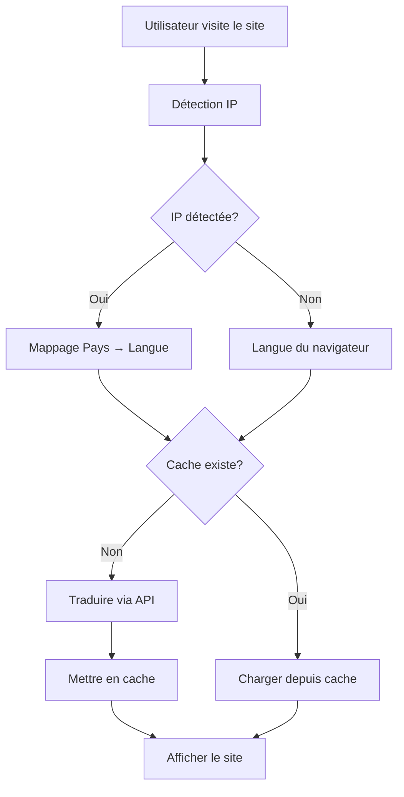

# 🌐 Système de Traduction Automatique basé sur l'IP

## Vue d'ensemble

Le site web utilise désormais un **système de traduction automatique intelligent** qui détecte automatiquement la langue de l'utilisateur selon son adresse IP et traduit le contenu à la volée, sans nécessiter de fichiers de traduction pré-créés.

## 🚀 Fonctionnalités

### 1. Détection Automatique de la Langue
- **Géolocalisation IP** : Détecte le pays de l'utilisateur via son adresse IP
- **Mappage Pays → Langue** : Conversion automatique du code pays en langue appropriée
- **Fallback Intelligent** : Utilise la langue du navigateur si la détection IP échoue
- **Cache 24h** : Les résultats sont mis en cache pour éviter les requêtes répétées

### 2. Traduction en Temps Réel
- **API de Traduction** : Utilise MyMemory Translation API (gratuite, 1000 requêtes/jour)
- **Cache Local** : Les traductions sont stockées en localStorage pour éviter les re-traductions
- **Préchargement** : Les traductions sont préchargées au démarrage pour une navigation fluide
- **Traduction Récursive** : Parcourt automatiquement toute la structure de traductions

### 3. Support Multi-Langues Étendu
Langues supportées via détection IP :
- 🇫🇷 Français (FR, CA, BE, CH)
- 🇬🇧 Anglais (US, GB, AU, NZ, IE)
- 🇪🇸 Espagnol (ES, MX, AR, CO, CL, PE)
- 🇩🇪 Allemand (DE, AT)
- 🇮🇹 Italien (IT)
- 🇷🇺 Russe (RU, BY, KZ)
- 🇵🇹 Portugais (PT, BR)
- Et bien d'autres...

## 📁 Architecture

```
src/
├── services/
│   ├── geolocation.service.ts    # Détection de langue via IP
│   └── translation.service.ts    # Service de traduction automatique
├── context/
│   └── TranslationContext.tsx    # Contexte React pour les traductions
└── App.jsx                        # Application principale mise à jour
```

## 🔧 Services Créés

### 1. `geolocation.service.ts`
**Responsabilités :**
- Détecter l'adresse IP de l'utilisateur
- Déterminer le pays via des APIs gratuites (ipapi.co, ip-api.com, freeipapi.com)
- Convertir le code pays en langue
- Gérer le cache (24 heures)

**Fonctions principales :**
```typescript
detectUserLanguage(): Promise<string>  // Détecte la langue de l'utilisateur
refreshUserLanguage(): Promise<string> // Force la re-détection
getUserLanguage(): string              // Récupère la langue depuis le cache
```

### 2. `translation.service.ts`
**Responsabilités :**
- Traduire les textes via MyMemory API
- Gérer le cache de traduction
- Traduire des objets complexes récursivement
- Précharger les traductions

**Fonctions principales :**
```typescript
translateText(text, targetLang): Promise<string>           // Traduit un texte simple
translateObject(obj, targetLang): Promise<any>             // Traduit un objet complet
translateBatch(texts, targetLang): Promise<string[]>       // Traduit plusieurs textes
preloadTranslations(base, targetLang): Promise<any>        // Précharge toutes les traductions
clearTranslationCache(): void                              // Nettoie le cache
```

### 3. `TranslationContext.tsx`
**Responsabilités :**
- Fournir les traductions à toute l'application
- Gérer l'état de la langue courante
- Permettre le changement manuel de langue
- Afficher un état de chargement

**Hook d'utilisation :**
```typescript
const { lang, setLang, t, loading } = useTranslation();
```

## 💻 Utilisation dans les Composants

### Avant (ancien système)
```jsx
import { LanguageContext } from '../App';
const { t } = useContext(LanguageContext);
```

### Après (nouveau système)
```jsx
import { useTranslation } from '../context/TranslationContext';
const { t, lang, setLang, loading } = useTranslation();
```

### Exemple Complet
```jsx
import { useTranslation } from '../context/TranslationContext';

function MyComponent() {
  const { t, lang, setLang, loading } = useTranslation();
  
  if (loading) {
    return <div>🌐 Chargement...</div>;
  }
  
  return (
    <div>
      <h1>{t.home.welcome}</h1>
      <p>{t.home.subtitle}</p>
      <button onClick={() => setLang('en')}>English</button>
    </div>
  );
}
```

## 🎯 Avantages du Nouveau Système

### ✅ Plus Besoin de Fichiers de Traduction
- ❌ Ancien : `translations.js` avec ~300 lignes de traductions manuelles
- ✅ Nouveau : Traductions automatiques à la demande

### ✅ Support Illimité de Langues
- ❌ Ancien : Limité aux 6 langues pré-traduites (fr, en, es, de, it, ru)
- ✅ Nouveau : Supporte toutes les langues disponibles sur MyMemory API

### ✅ Détection Automatique
- ❌ Ancien : L'utilisateur doit changer la langue manuellement
- ✅ Nouveau : Langue détectée automatiquement selon l'IP

### ✅ Maintenance Simplifiée
- ❌ Ancien : Chaque nouveau texte nécessite 6 traductions manuelles
- ✅ Nouveau : Les traductions sont générées automatiquement

### ✅ Performance Optimale
- Cache multi-niveaux (localStorage + mémoire)
- Préchargement au démarrage
- Traductions batch pour l'efficacité

## 🔄 Flux de Fonctionnement



## 🌐 APIs Utilisées

### 1. Géolocalisation IP (Gratuites)
- **ipapi.co** : 1000 requêtes/jour
- **ip-api.com** : 45 requêtes/minute
- **freeipapi.com** : Illimité

### 2. Traduction
- **MyMemory API** : 1000 requêtes/jour par IP (gratuit)
- **Alternative** : LibreTranslate (open source, peut être auto-hébergé)

## ⚙️ Configuration

### Changer l'API de Traduction
Dans `translation.service.ts`, vous pouvez facilement basculer vers LibreTranslate :

```typescript
// Utiliser LibreTranslate au lieu de MyMemory
const translated = await translateWithLibreTranslate(text, targetLang);
```

### Ajouter une Nouvelle Langue
Dans `geolocation.service.ts`, ajoutez simplement le code pays :

```typescript
const COUNTRY_TO_LANGUAGE: { [key: string]: string } = {
  // ... langues existantes
  JP: 'ja',  // Japonais
  CN: 'zh',  // Chinois
  // ...
};
```

### Ajuster le Cache
```typescript
// Dans geolocation.service.ts
const cacheAge = Date.now() - parseInt(cacheTime);
if (cacheAge < 24 * 60 * 60 * 1000) { // 24 heures
  // Modifier cette valeur pour ajuster la durée du cache
}
```

## 🐛 Dépannage

### La langue n'est pas détectée correctement
1. Vider le cache : `localStorage.clear()`
2. Forcer la re-détection : `refreshUserLanguage()`
3. Vérifier la console pour les erreurs d'API

### Les traductions ne s'affichent pas
1. Vérifier la connexion internet
2. Ouvrir la console et chercher les erreurs
3. Vérifier que MyMemory API est accessible
4. Limite de 1000 requêtes/jour peut être atteinte

### Performance lente
1. Les traductions sont mises en cache automatiquement
2. Première visite = chargement initial
3. Visites suivantes = instantané (cache)

## 🚀 Améliorations Futures

### Court Terme
- [ ] Ajouter un indicateur visuel de traduction en cours
- [ ] Implémenter un fallback si MyMemory API est down
- [ ] Ajouter des tests unitaires

### Long Terme
- [ ] Auto-héberger LibreTranslate pour plus de contrôle
- [ ] Implémenter un système de traduction hybride (cache serveur)
- [ ] Ajouter la détection de langue par contenu (pas seulement IP)
- [ ] Créer un dashboard admin pour gérer les traductions

## 📊 Monitoring

Le système log automatiquement les événements importants :
- 🌍 Langue détectée
- 🔄 Traductions chargées
- ✅ Cache utilisé
- ⚠️ Erreurs d'API

Ouvrez la console du navigateur pour voir les logs en temps réel.

## 🔐 Sécurité & Confidentialité

- **Aucune donnée personnelle** n'est stockée
- **IP non persistée** : Utilisée uniquement pour la détection
- **Cache local** : Stocké uniquement dans le navigateur de l'utilisateur
- **Pas de tracking** : Aucun suivi des utilisateurs

## 📝 Notes Importantes

1. **API Gratuite** : MyMemory limite à 1000 traductions/jour par IP
2. **Qualité** : Les traductions automatiques peuvent ne pas être parfaites
3. **Langue Source** : Le site est en français par défaut
4. **Fallback** : Si la traduction échoue, le texte original (français) est affiché

## 🆘 Support

Pour toute question ou problème :
1. Consultez la console du navigateur
2. Vérifiez les logs de traduction
3. Testez avec `clearTranslationCache()` pour réinitialiser

---

**Version** : 2.1.0  
**Date** : Janvier 2026  
**Auteur** : Auth Interactive
